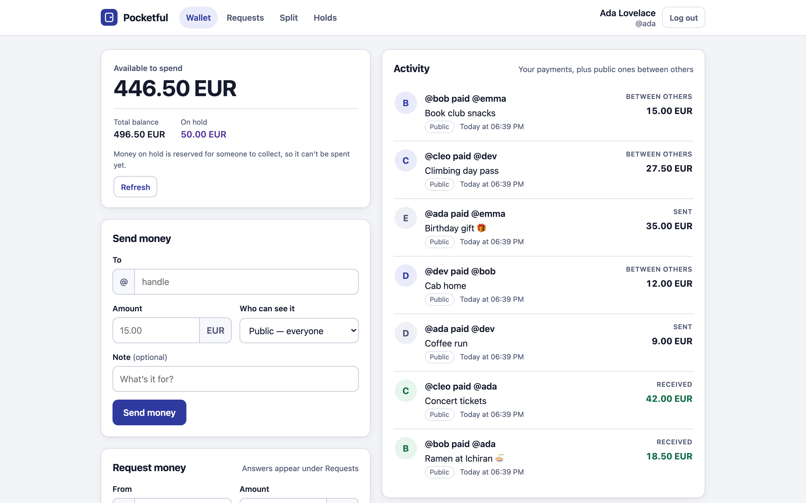
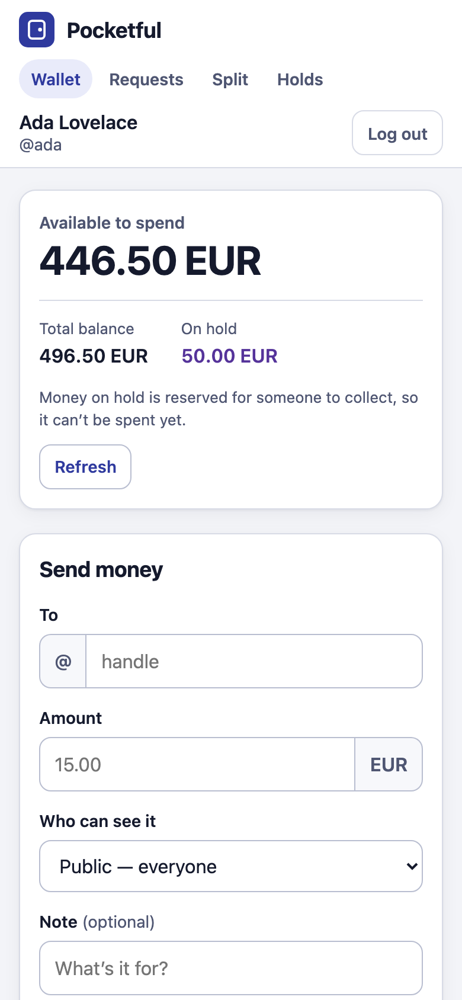
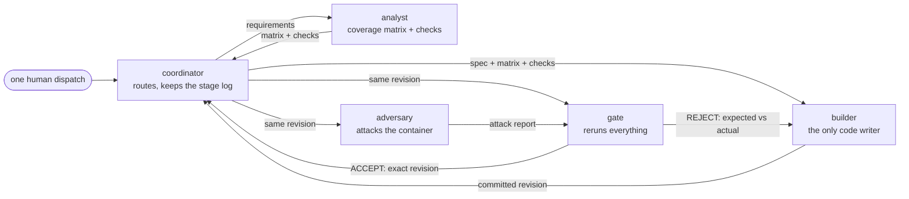

# Pocketful Dark Factory: proof before ship

> A dark factory that refuses to ship unless another seat can reproduce, attack and explain the result.

Track: **pocketful** · Team: Sravya Rachakonda (solo) · WeAreDevelopers x BAND Dark Factory, October 2026

**4 of 4 stages** claim their stage on a fresh clone in isolated mode · **7 real defects** caught by
review before acceptance · **$123.87** measured API-equivalent cost, per seat · every stage starts
with **no network**

| Wallet (desktop) | Wallet (phone) |
|---|---|
|  |  |

The app above is exactly what the band built (`stage-4/`), shown with synthetic demo data.

**Run report (one page, visual):** https://sravya1802.github.io/pocketful-dark-factory/ — every seat's work on a timeline, every REJECT and ACCEPT, every human message, stalls shown honestly.

## For judges (90 seconds)

1. **What this is.** Five BAND Desktop seats built this wallet service from one dispatched task.
   Only the builder writes product code. The analyst turns the spec into a coverage matrix and
   black-box checks before any code exists. The adversary attacks the running container. The gate
   reruns everything on the exact revision and gives no verdict until the adversary's report for
   that revision is in.

2. **Stages.**

   | Stage | Folder | Commit | Review | Isolated harness, fresh clone |
   |---|---|---|---|---|
   | 1 | `stage-1/` | `621342c` | gate ACCEPT after 2 real rejections | claims stage 1 |
   | 2 | `stage-2/` | `92bbbf9` | gate ACCEPT first time | claims stage 2 |
   | 3 | `stage-3/` | `c5b8629` | gate ACCEPT after 1 real rejection (`8737866`) | claims stage 3 |
   | 4 | `stage-4/` | `7cd430a` | gate ACCEPT first time (`eeea755`) | claims stage 4 |

3. **Verify it yourself** (from the kickoff checkout `band-ai/dark-factory-wearedevs`):
   ```sh
   python -m harness check <this-repo> --track pocketful
   python -m harness run --track pocketful --repo <this-repo> --all --mode isolated
   ```
   Our own run of exactly this, plus a `--network none` start of every stage, is in
   [`evidence/final-check/`](evidence/final-check/).

4. **Run the app.**
   ```sh
   docker build -t pocketful-s4 stage-4 && docker run --rm -p 8080:8080 pocketful-s4
   python3 factory/scripts/load-demo-data.py http://localhost:8080   # optional synthetic demo data
   # open http://localhost:8080, log in as ada@example.test / demo-pass-123
   ```

## How the factory works



No seat both produces and judges evidence. Every rejection carries expected-versus-actual evidence
and a reproduction script, and the fix comes back through the room. Details, costs and lessons:
[`FACTORY.md`](FACTORY.md).

## What review caught

| Stage | Defect | Outcome |
|---|---|---|
| 1 | Crash (heap exhausted) under 50 concurrent large requests | REJECT, fixed |
| 1 | Large bodies stalled the server past the 5 s budget | REJECT, fixed |
| 1 | Over-long idempotency key returned 400 instead of 422 | REJECT, fixed |
| 1 | The crash fix capped bodies, so the service refused its own export after ~28,000 payments | REJECT, fixed, ACCEPT |
| 3 | Statement snapshots leaked memory until the service died | REJECT, fixed |
| 3 | Expired seeded hold disagreed between historical and current views | REJECT, fixed |
| 3 | Valid RFC 3339 forms (lowercase `t`/`z`, leap second) rejected | REJECT, fixed, ACCEPT |

Before any stage-3 fix, the adversary's oracle fuzz found **0 mismatches in ~94,000 randomized
comparisons** of the corrected ledger. In stage 4 the oracle covered refunds and batch corrections:
**0 failures in 59,610 comparisons**.

## Where the evidence is

- [`mandates/`](mandates/): the five generic seat mandates (no track vocabulary; scanned against every track)
- [`room.json`](room.json): the BAND console download (latest 1,300 messages)
- [`room-full.json`](room-full.json): the complete room, all 2,321 messages from the dispatch on, exported page by page with `band room messages --json`
- [`evidence/stage-log.md`](evidence/stage-log.md): every handoff, verdict and rework loop, kept by the coordinator
- `evidence/stage-N/`: coverage matrices (stage 1: 214 rows, 192 checks), attack reports and scripts, gate verdicts
- [`evidence/final-check/`](evidence/final-check/): fresh-clone harness run and `--network none` start logs
- [`FACTORY.md`](FACTORY.md): seats, design, setup, measured cost, mistakes caught, lessons
- [`factory/`](factory/): the dispatch message and the operator scripts used around the run

## Human input, audited

Of 2,312 messages in the room, **5 are human (0.2%)**: the dispatch, three factual resume notes after
a seat stopped (two Claude usage limits, one missed handoff), and one owner acceptance of stage 3 after
the adversary had verified the fixes. The four notes after the dispatch total 220 words and contain no
technical instruction; each trigger is visible in the room. FACTORY.md §6 lists every word, what
triggered it, what the band did next, and the generic fix that removes it next time.

- Two low findings are recorded as non-blocking follow-ups in the gate's verdicts (old-snapshot paging
  slows at very large histories; an import can carry an impossible future snapshot time).
- Screenshots and `factory/scripts/load-demo-data.py` use synthetic data only: fictional users, no real money.
